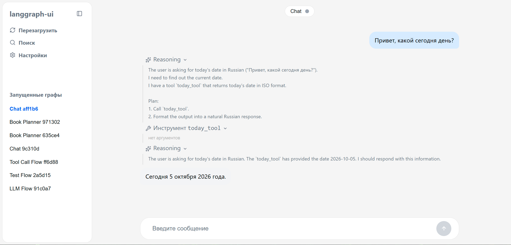
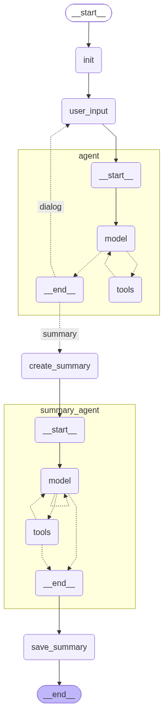

# langgraph-ui



Backend and frontent service for interacting with arbitrary graphs.
 - Streaming responses (resoning, text, tool calls)
 - Supports chatting with your graphs via 'messages' key.
 - Chat history, graphs switcher, dynamic reload

## Overview

Application consists of backend and frontend serivces. Backend provides neccessary api route for intercating with graphs (start, resume, list sessions and etc), frontend provides web application for launching your graphs, viewing their output in streaming mode and intercating with their state (used for chatting via `messages` key).

## setup
First, install requirements.txt:
```
pip install -r requirements.txt
```
Run backend and fronend service in separate terminals:
```
# backend
python -m backend.main   # backend

# frontend
cd frontend
npm run dev
```

## user graphs

All user graphs can be placed inside `backend/graphs/user/<user_graph_name>`. Application will automatically scan this folder and try to compile all user graphs.

On error pop-up error window is shown, graphs can be reloaded via `reload` button in the ui.

### book_planner

This is example single graph that uses multiple langchain agents with tools, custom middleware, conditional loop-exit and structured output.


